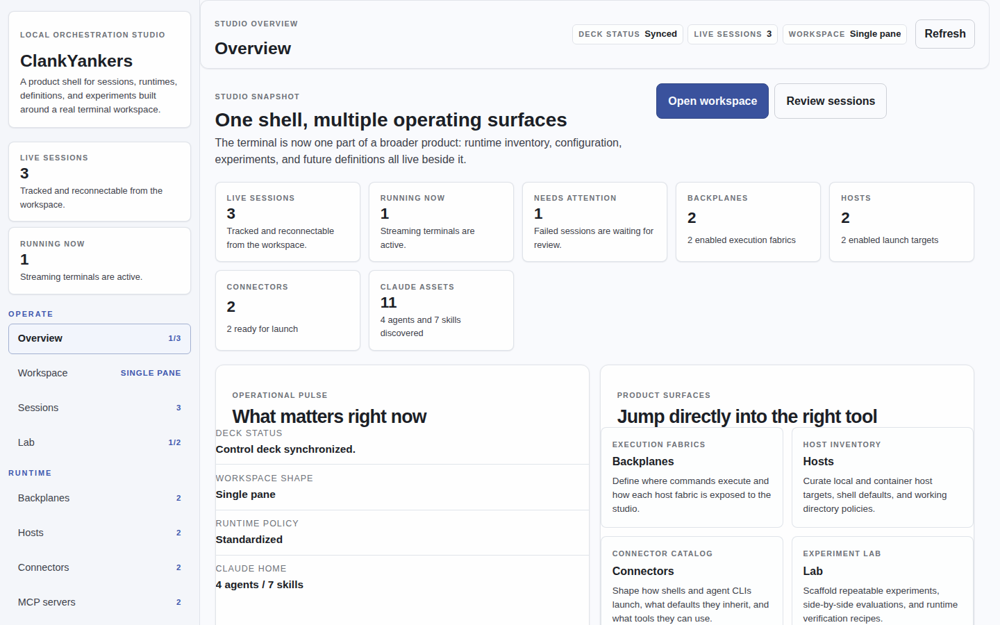
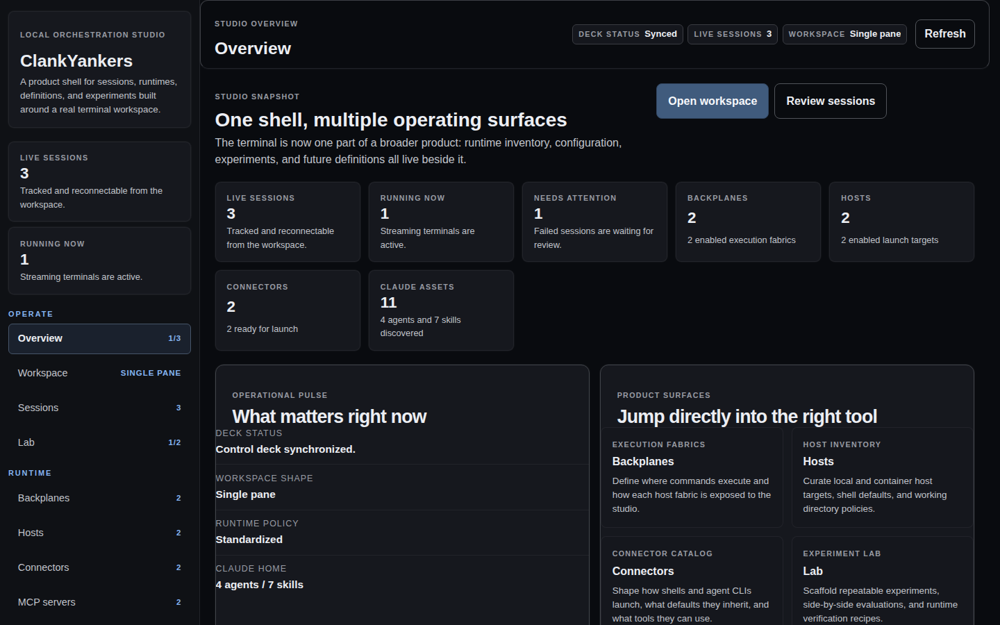
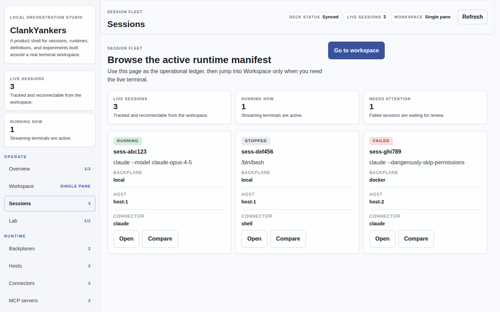
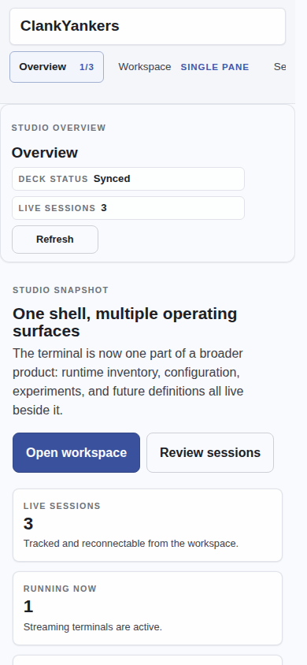
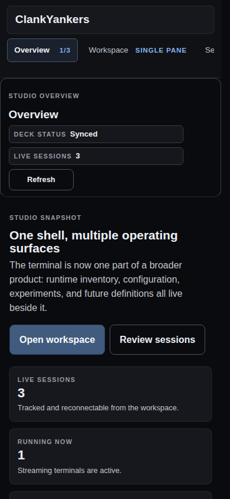

# ClankYankers

> **A browser-based orchestration platform for agentic CLI tools**
> Run, manage, and monitor AI agent CLIs (Claude Code, Ollama, Codex, Gemini, and more) from a unified browser terminal.

[](https://github.com/JerrettDavis/ClankYankers/actions/workflows/ci.yml)
[](https://github.com/JerrettDavis/ClankYankers/security/code-scanning)
[](LICENSE)

---

## Overview

ClankYankers is a browser-based orchestration platform that provides a unified terminal interface for interacting with agentic CLI tools across multiple execution environments. Whether you're running Claude Code locally, spinning up Ollama inside a Docker container, or experimenting with multiple agents side-by-side, ClankYankers gives you a single, consistent interface.

### Key Features

- **Browser-native terminal** — Full interactive terminal powered by xterm.js; ANSI rendering, keyboard passthrough, and resize support
- **Multiple execution backplanes** — Run sessions on your local machine, inside Docker, over SSH, or through a remote daemon node
- **Agent connectors** — Built-in support for Claude Code, Ollama, OpenClaw, Codex, and Gemini CLI
- **Session management** — Start, stop, reconnect to, and run multiple sessions concurrently
- **Plugin-driven extensibility** — Add new backplanes, connectors, and lifecycle hooks without modifying the core
- **Configuration UI** — Manage backplanes, hosts, and connectors from the browser
- **Event-driven lifecycle** — Hook into session start/stop, command execution, and output events

---

## Screenshots

> Screenshots are captured automatically by the Reqnroll acceptance suite and refreshed on a weekly schedule. See [`tests/ClankYankers.Studio.AcceptanceTests`](tests/ClankYankers.Studio.AcceptanceTests) and the [screenshots workflow](.github/workflows/screenshots.yml).

### Overview — light mode (desktop)


### Overview — dark mode (desktop)


### Sessions — light mode (desktop)


### Overview — mobile (390 × 844)

| Light | Dark |
|-------|------|
|  |  |

---

## Quick Start

### Prerequisites

- [.NET 10 SDK](https://dotnet.microsoft.com/download/dotnet/10.0)
- [Node.js 20+](https://nodejs.org/) (for the web frontend)
- Docker (optional, for Docker and docker-backed remote executor support)
- OpenSSH-compatible target (optional, for SSH backplane support)

### Run the app

```bash
git clone https://github.com/JerrettDavis/ClankYankers.git
cd ClankYankers

# Start the backend server and SPA together in development
dotnet run --project apps/server/ClankYankers.Server
```

`dotnet run` now launches the Vite SPA automatically in development and opens the browser through the ASP.NET Core host. The web UI is served through the SPA proxy at `http://127.0.0.1:5173` and the API server remains available from the ASP.NET Core app at `http://localhost:5023`.

If you want to work on the frontend separately, you can still run it directly:

```bash
cd apps/web
npm install
npm run dev
```

### Run the tests

```bash
# Unit and integration tests
dotnet test ClankYankers.slnx

# Frontend tests
cd apps/web
npm run test

# E2E tests
cd apps/web
npm run test:e2e
```

### Remote daemon tool

The remote backplane is powered by a dedicated cross-platform .NET tool in `apps/daemon/ClankYankers.Daemon`.

```bash
dotnet pack apps/daemon/ClankYankers.Daemon -c Release
dotnet tool install --global --add-source apps/daemon/ClankYankers.Daemon/bin/Release ClankYankers.Daemon
clank-daemon
```

The daemon exposes HTTP and WebSocket endpoints for session lifecycle, streaming terminal IO, node metadata, and self-update orchestration. Hosts configured against the `remote` backplane point the server at that daemon URL.

### Backplane matrix

| Backplane | Transport | Typical target | Notes |
|------|---------|---------|-------|
| `local` | In-process PTY | Current machine | Lowest-latency terminal path |
| `docker` | Local Docker API | Container on current machine | Uses the configured host image and working directory |
| `ssh` | SSH shell stream | Remote machine over SSH | Supports password, private key, certificate, and keyboard-interactive auth |
| `remote` | HTTP + WebSocket via `clank-daemon` | Remote node process or remote Docker | Supports bearer auth, optional insecure TLS, and daemon self-update |

---

## Architecture

ClankYankers is a hybrid stack — a .NET 10 backend for process control and streaming, paired with a React + xterm.js frontend for the terminal UI.

```
Browser (React + xterm.js)
    ↕ WebSocket (bi-directional)
Application Server (.NET 10 / ASP.NET Core)
    ├── Session Orchestrator
    ├── Backplane Layer (Local / Docker / SSH / Remote)
    └── Connector Layer (Claude / Ollama / ...)
         ↓
Execution Targets (Local machine / Docker containers / SSH hosts / Remote daemon nodes)
```

### Solution Structure

| Path | Purpose |
|------|---------|
| `apps/server/ClankYankers.Server` | ASP.NET Core backend — session orchestration, PTY management, WebSocket API |
| `apps/daemon/ClankYankers.Daemon` | Packable `clank-daemon` tool — remote node daemon for process/docker execution |
| `apps/web` | React + TypeScript frontend — terminal UI, session management |
| `shared/ClankYankers.Remote.Contracts` | Shared DTO contracts between the server and remote daemon |
| `tests/ClankYankers.Server.UnitTests` | Unit tests for the server |
| `tests/ClankYankers.Server.IntegrationTests` | Integration tests for local, Docker, SSH, and remote backplanes |

### WebSocket API

Sessions communicate over WebSocket at `/ws/session/{sessionId}`.

**Client → Server**
```json
{ "type": "input", "data": "ls -la\n" }
{ "type": "resize", "cols": 120, "rows": 40 }
```

**Server → Client**
```json
{ "type": "output", "data": "..." }
{ "type": "exit", "code": 0 }
```

---

## Milestones

- [x] **M0** — Project scaffold, WebSocket connection
- [x] **M1** — Local terminal execution (PTY, STDIN/STDOUT streaming)
- [x] **M2** — Session management, reconnect support
- [x] **M3** — Connector abstraction (Claude Code)
- [x] **M4** — Docker backplane
- [ ] **M5** — Multi-connector support (OpenClaw, Ollama, Codex, Gemini)
- [x] **M6** — Configuration system + UI
- [ ] **M7** — Plugin system extraction
- [ ] **M8** — Hardening + packaging (Docker image, release artifacts)

---

## Documentation

- [Business Requirements (BRD)](docs/BRD.md)
- [Technical Design (DESIGN.md)](docs/DESIGN.md)
- [Implementation Plan (PLAN.md)](docs/PLAN.md)
- [API Documentation](https://jerrettdavis.github.io/ClankYankers)

---

## Contributing

Contributions are welcome! Please see our [Contributing Guide](CONTRIBUTING.md) for details.

1. Fork the repository
2. Create a feature branch (`git checkout -b feat/amazing-feature`)
3. Commit your changes using [Conventional Commits](https://www.conventionalcommits.org/)
4. Push to the branch (`git push origin feat/amazing-feature`)
5. Open a Pull Request

---

## License

This project is licensed under the MIT License — see the [LICENSE](LICENSE) file for details.
