# ClankYankers Living BDD Walkthrough

ClankYankers is a **browser-based terminal studio for launching and orchestrating local shell and agent CLI sessions**. Today it demonstrably launches real local shells, launches a real Ollama CLI runtime, persists runtime configuration, supports multi-session workspace orchestration, and keeps the entire control deck theme-aware and responsive.

This is the living behavior document for the current local ClankYankers build. It translates the implemented end-to-end experience into readable BDD scenarios, ties each scenario back to automated coverage, and embeds screenshots from the actual running product.

The goal is simple: a teammate should be able to read this file, understand what ClankYankers does today, and compare the screenshots against the shipped UI and test suite without guessing.

## Source of truth

- Product intent: `PROMPT.md`
- Architecture and boundaries: `DESIGN.md`
- Development and testing discipline: `AGENTS.md`
- Primary browser acceptance coverage: `apps/web/e2e/control-deck.spec.ts`
- Server-side contract and hardening coverage:
  - `tests/ClankYankers.Server.UnitTests/ConnectorTests.cs`
  - `tests/ClankYankers.Server.UnitTests/ConfigAndEventTests.cs`
  - `tests/ClankYankers.Server.UnitTests/SessionOrchestratorTests.cs`

## Current verification baseline

This document reflects the locally verified behavior from the current build:

- Last locally refreshed: **2026-04-05**
- Latest implementation baseline before this doc pass: **`11df660`** (`feat(connectors): launch real agent CLIs`)

- `dotnet test ClankYankers.slnx --nologo`
- `npm test`
- `npm run lint`
- `npm run build`
- `npx playwright test`

Playwright result at the time of writing: **6 passed, 1 skipped**. The skipped scenario is the Docker runtime flow, which is intentionally capability-gated by local machine support.

## Verification matrix

| Scenario | Latest local status | Prerequisite | Evidence |
| --- | --- | --- | --- |
| S1 Theme-aware studio viewport | Verified in latest run | None | Playwright + screenshots |
| S2 Runtime configuration persistence | Verified in latest run | None | Playwright + screenshots |
| S3 Connector-aware launch surface | Verified in latest run | None | Playwright + screenshots |
| S4 Local shell execution | Verified in latest run | Local PTY-capable shell | Playwright + screenshots |
| S5 Orchestration, pane layout, and history | Verified in latest run | Two local sessions | Playwright + screenshots |
| S6 Docker launch path | Capability-gated | Docker daemon/runtime available locally | Playwright skip gate + launch-state screenshot |
| S7 Ollama agent runtime | Verified in latest run | Local `ollama` install and `qwen3.5:9b` model present | Playwright + screenshots |
| Claude live runtime launch | Not exercised in browser E2E on this machine | Local `claude` CLI available | Launch UX screenshots + server/unit coverage |

## Scenario index

| ID | Scenario | What it proves | Automated source |
| --- | --- | --- | --- |
| S1 | Theme-aware studio viewport | The app stays locked to the viewport, adapts to system theme, and remains usable on mobile | `control-deck.spec.ts` - `adapts to system theme and stays locked to the viewport` |
| S2 | Runtime configuration persistence | Config edits save, reload, and discard correctly | `control-deck.spec.ts` - `persists config changes and discards unsaved edits` |
| S3 | Connector-aware launch surface | Claude, Ollama, and Shell expose the right launch UX and policy surface | `control-deck.spec.ts` - `shows connector-specific launch overrides for client CLIs` |
| S4 | Local shell execution | A local shell session launches, streams output, and behaves like a real terminal | `control-deck.spec.ts` - `runs local shell flows end to end and records audit events` |
| S5 | Orchestration, pane layout, and history | Multiple sessions can be split, compared, reopened, and kept in history | `control-deck.spec.ts` - `covers workspace orchestration, compare panes, tab close and stop flows` |
| S6 | Docker launch path | Docker remains a first-class backplane option when the machine supports it | `control-deck.spec.ts` - `runs docker shell sessions when docker is available` |
| S7 | Ollama agent runtime | The Ollama connector launches a real local agent CLI and returns model output | `control-deck.spec.ts` - `runs ollama connector sessions when the model is available` |

---

## S1. Theme-aware studio viewport

**Given** the user opens ClankYankers in the browser  
**When** the system theme changes and the viewport shrinks across desktop and phone sizes  
**Then** the control deck stays inside the viewport, the masthead remains compact, and internal panels own scrolling instead of the page

| Step | Action | Expected result | Evidence |
| --- | --- | --- | --- |
| 1 | Open the deck in light mode on a desktop viewport | The masthead, launch rail, and workspace compose into a studio layout with no document scroll drift | 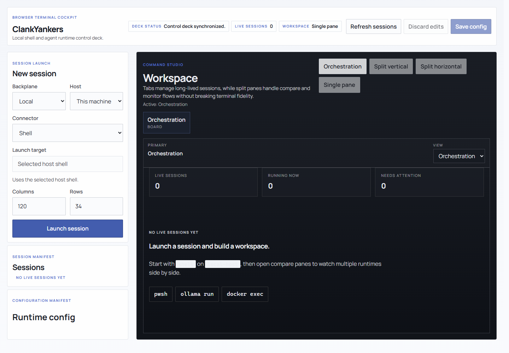 |
| 2 | Switch the browser to dark mode | The same layout remains intact while surfaces, contrast, and chrome adapt to the darker palette | 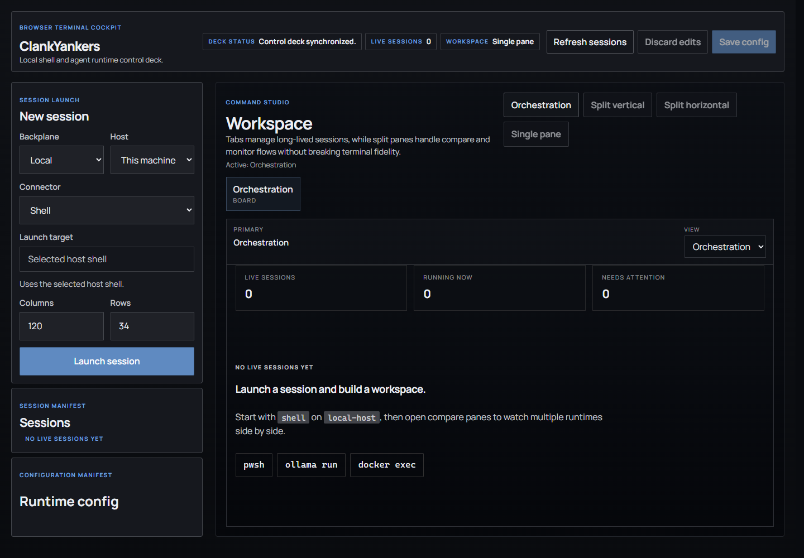 |
| 3 | Reduce the viewport to a phone-sized width | The deck reflows into a compact stacked layout without page-level overflow or clipped controls | 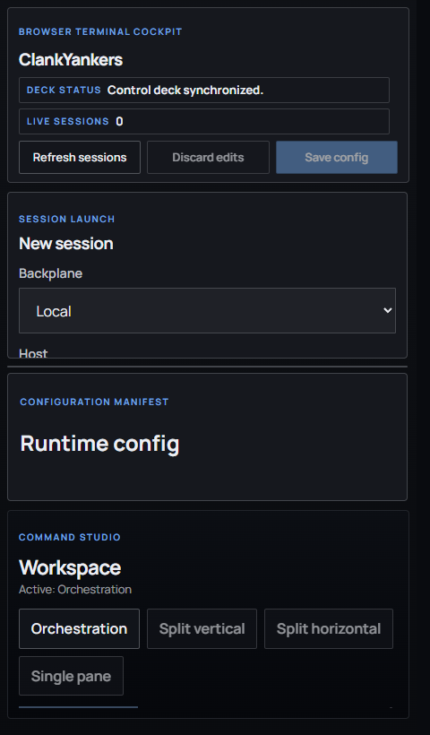 |

**What this means in practice**

- The application behaves like a contained studio shell, not a long scrolling page.
- Internal panels, not the browser document, own the movement and density changes.
- The UI remains usable from large monitors down to narrow mobile widths.

---

## S2. Runtime configuration persistence

**Given** the operator opens the runtime configuration manifest  
**When** they edit saved definitions for backplanes and connectors  
**Then** those changes can be saved, reloaded, and used immediately by the launch form

| Step | Action | Expected result | Evidence |
| --- | --- | --- | --- |
| 1 | Open the configuration manifest and rename the local backplane | The saved runtime definition is editable in-place without leaving the studio shell |  |
| 2 | Edit Claude connector policy fields such as base arguments, permission mode, and allowed tools | Connector launch policy is treated as saved runtime configuration, not an ad hoc per-session guess | 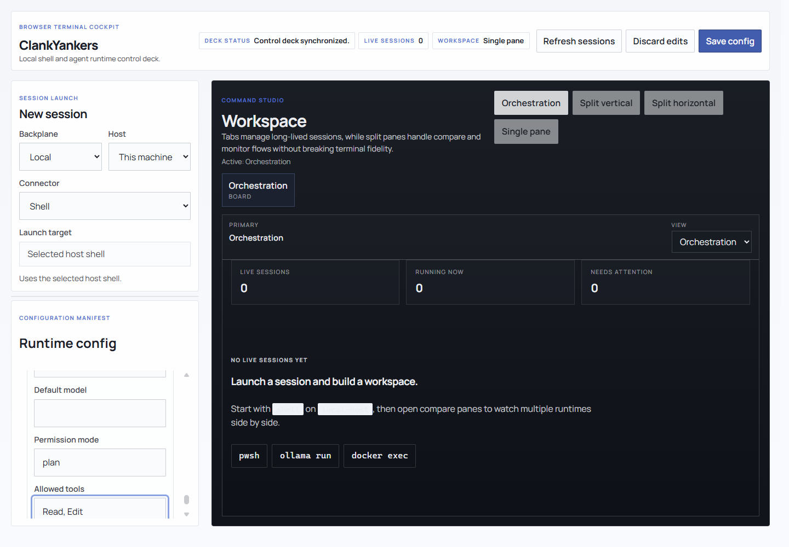 |
| 3 | Save the config and return to the launch surface | The launch form reflects the persisted connector policy and is ready to use it | 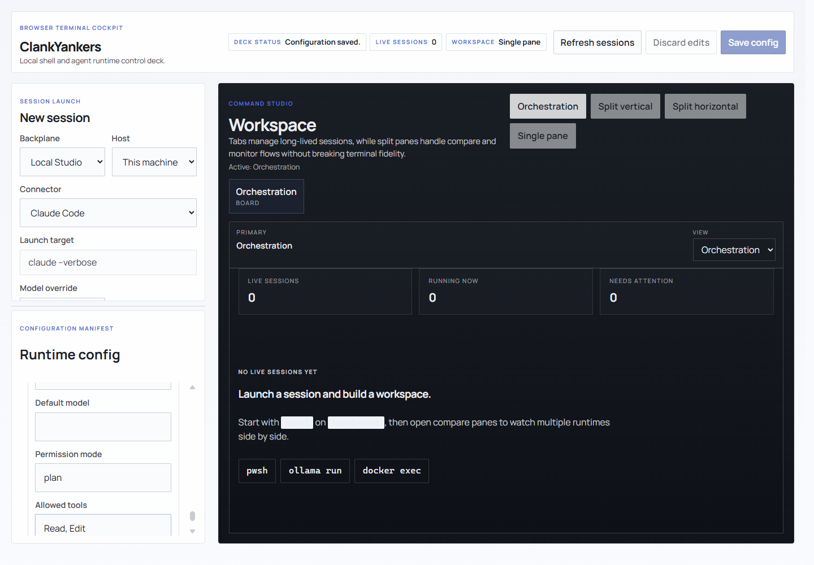 |

**What this means in practice**

- Runtime config is a first-class part of the product, not hidden implementation state.
- Connector launch policy is intentionally centralized in config so session launches stay predictable.
- The same saved config drives both the browser UI and the server-side launch path.
- Claude is documented here as a **configured and hardened launch path**, but not as a browser-E2E-verified live runtime on this machine.

---

## S3. Connector-aware launch surface

**Given** the operator is preparing a new session  
**When** they switch between connector types  
**Then** the launch form exposes only the overrides that make sense for that connector

| Step | Action | Expected result | Evidence |
| --- | --- | --- | --- |
| 1 | Select the Claude connector | The form shows client-app launch context, including model override and the resolved launch target preview |  |
| 2 | Select the Ollama connector | The form shows an Ollama-specific launch target and model override appropriate for `ollama run <model>` |  |
| 3 | Select the Shell connector | The override surface collapses back to a plain shell launch with host-shell guidance instead of agent-specific fields |  |

**What this means in practice**

- ClankYankers distinguishes between direct shell sessions and agent-client sessions.
- The UI explains what will actually be launched before the session starts.
- The connector abstraction is visible and understandable to the operator.

---

## S4. Local shell execution

**Given** a local backplane, local host, and Shell connector are selected  
**When** the operator launches a session and runs a command  
**Then** the browser terminal behaves like a real shell and renders the streamed output inside the workspace

| Step | Action | Expected result | Evidence |
| --- | --- | --- | --- |
| 1 | Launch a local shell session | A live terminal tab opens in the workspace and is bound to the selected runtime target | 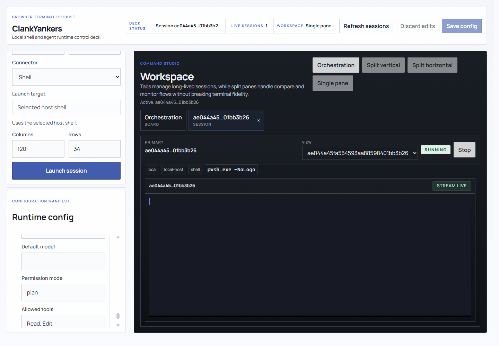 |
| 2 | Execute a command in the running session | The command output appears in the terminal transcript without leaving the browser shell | 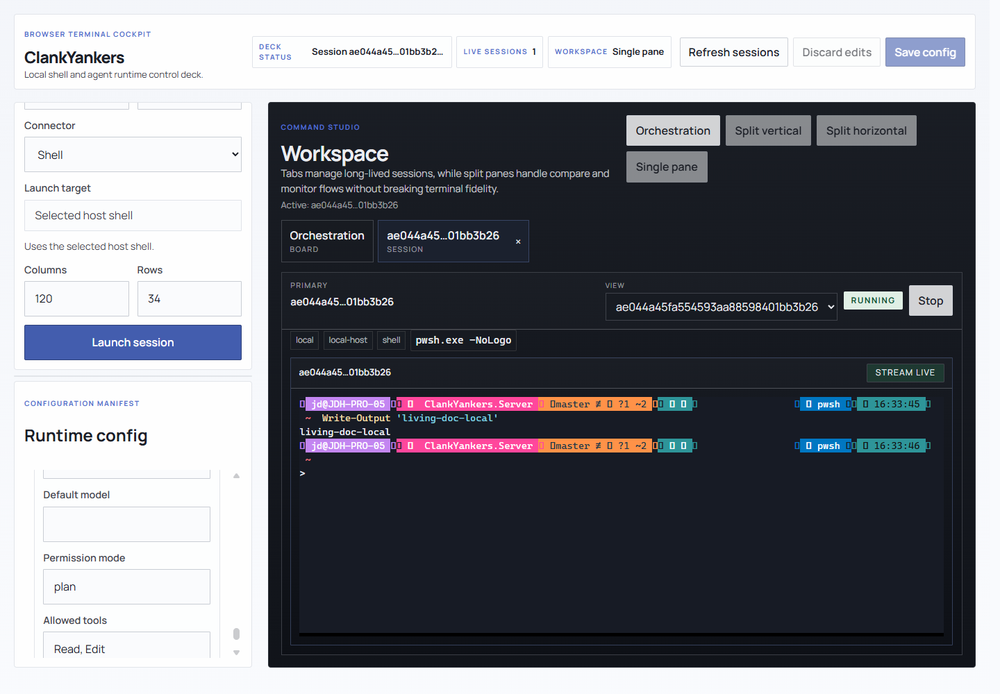 |

**What this means in practice**

- The terminal is not a fake stream widget; it is a real interactive session.
- Launching a session creates durable workspace state that can be managed alongside other sessions.
- Terminal fidelity remains the foundation of the whole product.

---

## S5. Orchestration, pane layout, and history

**Given** multiple live sessions exist  
**When** the operator splits panes, switches views, closes tabs, and reopens from the manifest  
**Then** ClankYankers behaves like a studio workspace rather than a single-terminal page

| Step | Action | Expected result | Evidence |
| --- | --- | --- | --- |
| 1 | Launch a second live session and split the workspace vertically | Two terminal panes can coexist in the same workspace without breaking focus or layout | 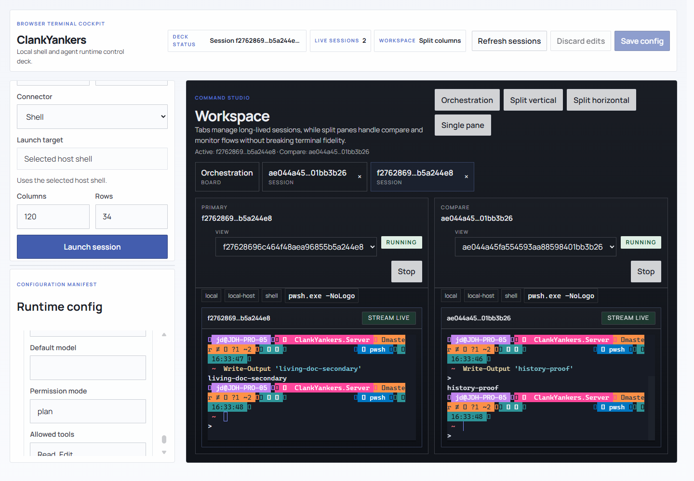 |
| 2 | Switch the secondary pane to the orchestration board | The secondary pane can show high-level workspace state instead of a terminal, enabling multi-window monitoring | 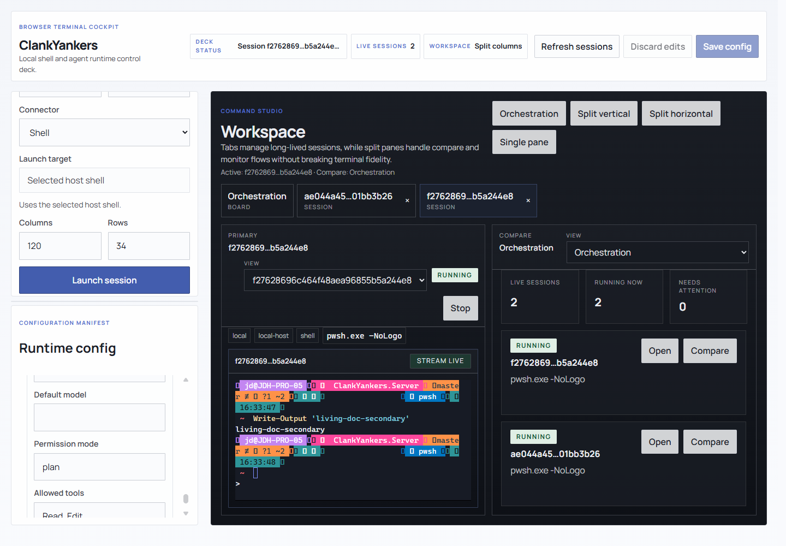 |
| 3 | Close a session tab and reopen it from the manifest | Session history remains available and the session can be restored into the workspace from the manifest rail | 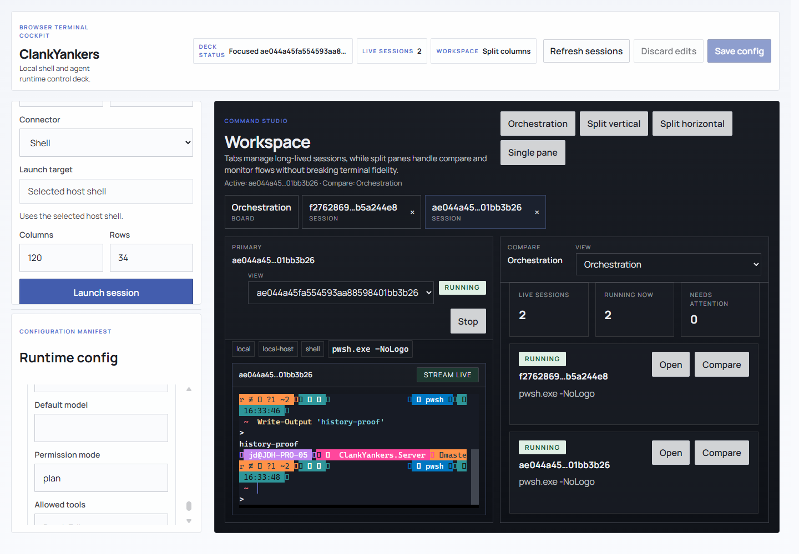 |

**What this means in practice**

- Sessions are durable workspace objects, not disposable terminal canvases.
- The studio supports pane composition and session context switching.
- History and reopen flows are part of the expected operating model.

---

## S6. Docker launch path

**Given** Docker is configured as an available backplane  
**When** the operator switches the launch surface to Docker  
**Then** the host and connector selection pivot to the Docker execution path

| Step | Action | Expected result | Evidence |
| --- | --- | --- | --- |
| 1 | Select the Docker backplane and keep the Shell connector | The launch surface resolves to the Docker host and shows the container-backed execution path |  |

**Capability note**

- The live Docker execution scenario is automated only when Docker is available on the current machine.
- In the latest local verification run, the Docker E2E was **skipped**, so this document captures the launch-state UX rather than a successful live container transcript.
- The feature remains implemented and covered by the capability-gated Playwright scenario.

---

## S7. Ollama agent runtime

**Given** the Ollama connector is selected and the required local model is present  
**When** the operator launches the session and sends a prompt  
**Then** ClankYankers launches the real Ollama CLI and returns the model response in the terminal workspace

| Step | Action | Expected result | Evidence |
| --- | --- | --- | --- |
| 1 | Select the Ollama connector from the launch surface | The operator can see that the session will start an agent CLI rather than a direct shell | 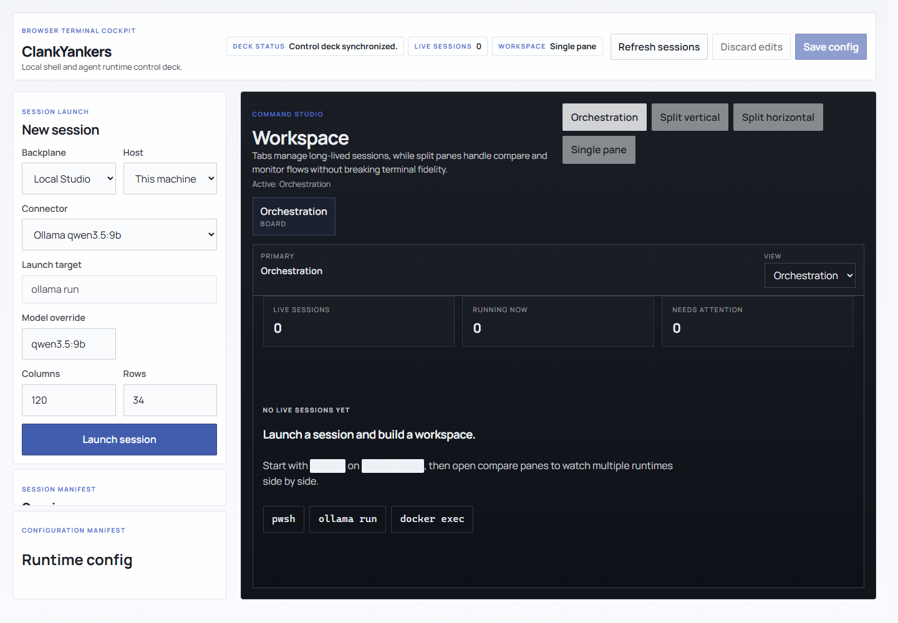 |
| 2 | Launch the session and send a prompt to the model | The terminal shows the model response in-place, proving the connector launches a real local agent runtime | 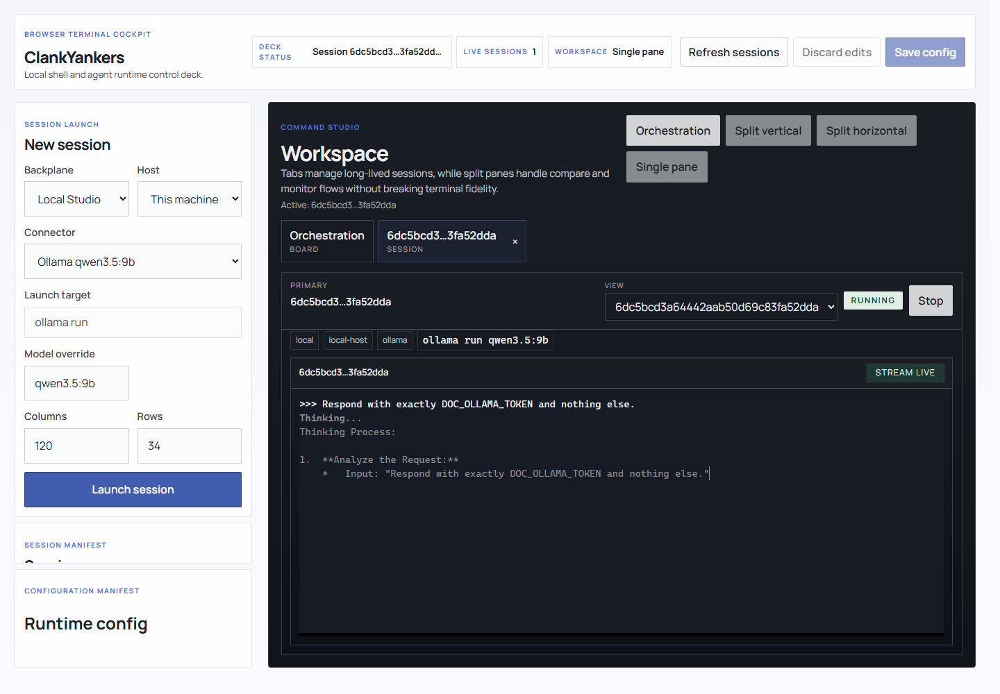 |

**What this means in practice**

- ClankYankers is not only a shell multiplexer; it is an agent-runtime cockpit.
- Ollama remains the concrete proof that connectors can launch and interact with a real CLI agent locally.
- The model interaction stays inside the same terminal-first workspace as every other runtime.

---

## Additional contract coverage behind the UI

The browser walkthrough above focuses on observable user behavior. The following critical behaviors are also enforced below the UI layer:

1. **Connector launch contracts**
   - Shell uses the selected host shell configuration.
   - Ollama preserves the required `run` subcommand and appends the effective model.
   - Claude strips reserved flags from freeform base arguments and applies permission policy explicitly.

2. **Runtime resolution**
   - Connectors resolve by **kind**, not by saved config id.
   - Backplanes resolve by **kind**, not by saved config id.
   - Disabled connectors, hosts, and backplanes are rejected server-side.

3. **Config and request hardening**
   - Session requests reject invalid dimensions and blank identifiers.
   - Saved config requires at least one enabled end-to-end launch path.
   - Enabled resources must have runtime-critical fields present.
   - Claude connectors cannot smuggle model or permission flags through arbitrary launch arguments.

These behaviors are covered in the unit test suite even when they do not produce a separate user-visible screenshot.

---

## Reader's quick summary

Today, ClankYankers demonstrably does the following:

- launches real local shell sessions in the browser
- persists and enforces runtime configuration
- differentiates shell and agent-launch connectors in the UI
- launches a real Ollama agent CLI locally
- supports workspace orchestration with multi-session panes and reopenable history
- keeps the whole control deck theme-aware, contained, and responsive

The safest way to keep this document alive is to update it whenever any of these files change:

- `apps/web/e2e/control-deck.spec.ts`
- `apps/web/src/App.tsx`
- `apps/web/src/index.css`
- `apps/server/ClankYankers.Server/Features/Sessions/*`
- `apps/server/ClankYankers.Server/Infrastructure/Connectors/*`

---

## How to regenerate this document

1. Open **terminal A** at the repository root:
   - `C:\\git\\ClankYankers`
   - run: `dotnet run --project apps\\server\\ClankYankers.Server --urls http://127.0.0.1:5023`
2. Open **terminal B** in the web app folder:
   - `C:\\git\\ClankYankers\\apps\\web`
   - run: `npm run dev -- --host 127.0.0.1 --port 5173`
3. From the repository root, re-run the automated verification baseline:
   - `dotnet test ClankYankers.slnx --nologo`
4. From `apps\\web`, re-run the frontend verification:
   - `npm test`
   - `npm run lint`
   - `npm run build`
   - `npx playwright test`
5. Recreate or refresh the screenshot set in `docs/assets/bdd/` using the same scenario states listed in this document. The expected files are:
   - `theme-light-overview.png`
   - `theme-dark-overview.png`
   - `theme-mobile-overview.png`
   - `config-backplane-edit.png`
   - `config-claude-policy.png`
   - `launch-claude-overrides.png`
   - `launch-ollama-overrides.png`
   - `launch-shell-default.png`
   - `session-local-started.png`
   - `session-local-output.png`
   - `workspace-split-vertical.png`
   - `workspace-orchestration-pane.png`
   - `workspace-history-reopen.png`
   - `docker-launch-target.png`
   - `ollama-launch.png`
   - `ollama-response.png`
6. Update this file whenever scenario names, prerequisites, automation status, or screenshot evidence changes
